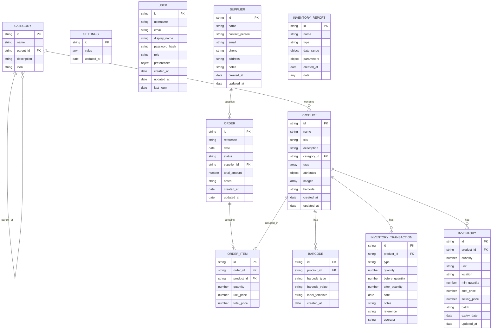
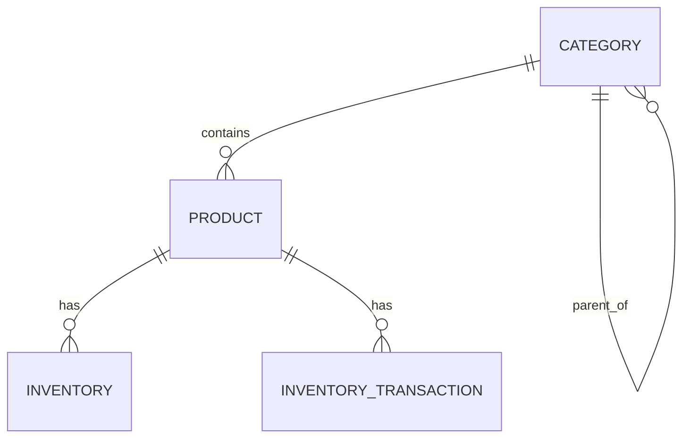
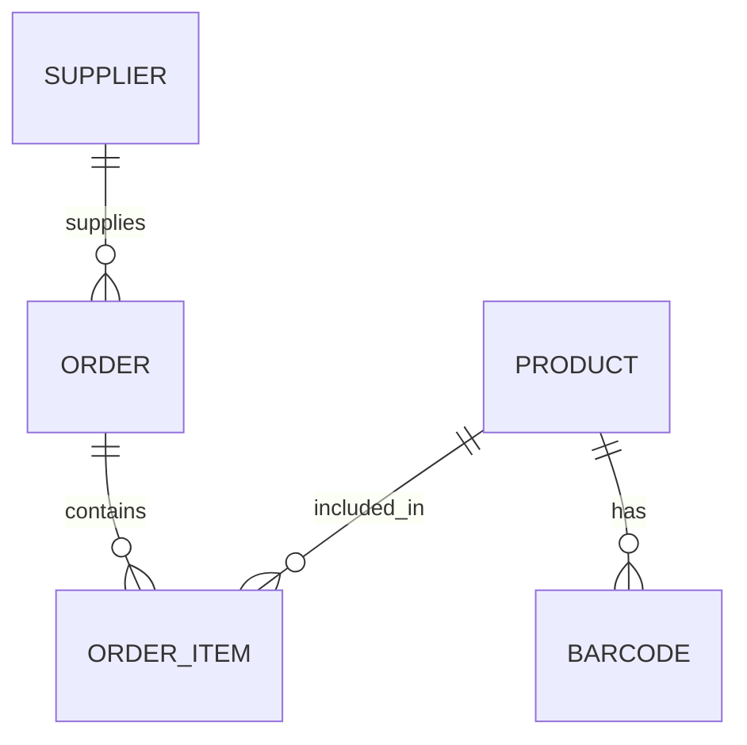

# SmartStock Database Schema Diagram

```mermaid
erDiagram
    PRODUCT {
        string id PK
        string name
        string sku
        string description
        string category_id FK
        array tags
        object attributes
        array images
        string barcode
        date created_at
        date updated_at
    }
    
    INVENTORY {
        string id PK
        string product_id FK
        number quantity
        string unit
        string location
        number min_quantity
        number cost_price
        number selling_price
        string batch
        date expiry_date
        date updated_at
    }
    
    INVENTORY_TRANSACTION {
        string id PK
        string product_id FK
        string type
        number quantity
        number before_quantity
        number after_quantity
        date date
        string notes
        string reference
        string operator
    }
    
    CATEGORY {
        string id PK
        string name
        string parent_id FK
        string description
        string icon
    }
    
    SETTINGS {
        string id PK
        any value
        date updated_at
    }
    
    USER {
        string id PK
        string username
        string email
        string display_name
        string password_hash
        string role
        object preferences
        date created_at
        date updated_at
        date last_login
    }
    
    SUPPLIER {
        string id PK
        string name
        string contact_person
        string email
        string phone
        string address
        string notes
        date created_at
        date updated_at
    }
    
    ORDER {
        string id PK
        string reference
        date date
        string status
        string supplier_id FK
        number total_amount
        string notes
        date created_at
        date updated_at
    }
    
    ORDER_ITEM {
        string id PK
        string order_id FK
        string product_id FK
        number quantity
        number unit_price
        number total_price
    }
    
    INVENTORY_REPORT {
        string id PK
        string name
        string type
        object date_range
        object parameters
        date created_at
        any data
    }
    
    BARCODE {
        string id PK
        string product_id FK
        string barcode_type
        string barcode_value
        string label_template
        date created_at
    }
    
    PRODUCT ||--o{ INVENTORY : "has"
    CATEGORY ||--o{ PRODUCT : "contains"
    CATEGORY ||--o{ CATEGORY : "parent_of"
    PRODUCT ||--o{ INVENTORY_TRANSACTION : "has"
    SUPPLIER ||--o{ ORDER : "supplies"
    ORDER ||--o{ ORDER_ITEM : "contains"
    PRODUCT ||--o{ ORDER_ITEM : "included_in"
    PRODUCT ||--o{ BARCODE : "has"
```

## Core Tables Relationships

```mermaid
erDiagram
    PRODUCT ||--o{ INVENTORY : "has"
    CATEGORY ||--o{ PRODUCT : "contains"
    CATEGORY ||--o{ CATEGORY : "parent_of"
    PRODUCT ||--o{ INVENTORY_TRANSACTION : "has"
```

## Future Expansion Tables Relationships

```mermaid
erDiagram
    SUPPLIER ||--o{ ORDER : "supplies"
    ORDER ||--o{ ORDER_ITEM : "contains"
    PRODUCT ||--o{ ORDER_ITEM : "included_in"
    PRODUCT ||--o{ BARCODE : "has"
```
